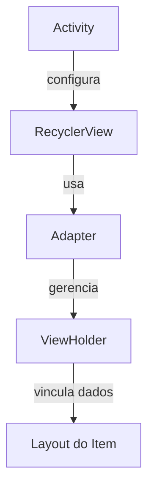
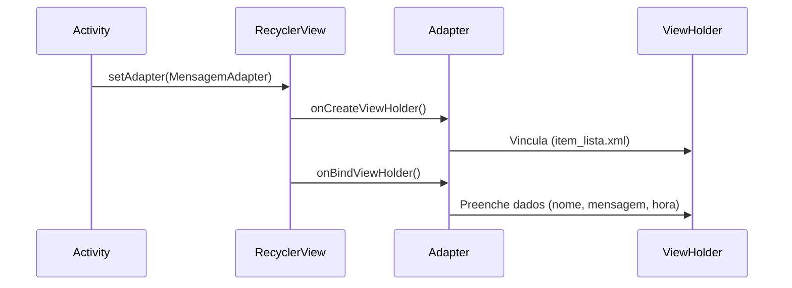

# 📱 Guia de Implementação do RecyclerView  

Resumo completo de como implementar um `RecyclerView` no Android usando Kotlin, com exemplos práticos de código.  

---

## 🏗️ **Visão Geral da Estrutura**  


---

## 🔑 **Componentes Principais**  

### 1. **Activity (`RecicleReniew.kt`)**  
Responsável por:  
- Criar a lista de dados (ex: mensagens).  
- Configurar o `RecyclerView` e definir o `Adapter`.  

```kotlin  
class RecicleReniew : AppCompatActivity() {  
    private lateinit var rvLista: RecyclerView  

    override fun onCreate(savedInstanceState: Bundle?) {  
        super.onCreate(savedInstanceState)  
        setContentView(R.layout.activity_recicle_reniew)  

        // Lista de exemplo  
        val lista = listOf(  
            Mensagem("João", "Oi!", "12:00"),  
            Mensagem("Carlos", "Tudo bem?", "13:00")  
        )  

        // Configuração do RecyclerView  
        rvLista = findViewById(R.id.Rview)  
        rvLista.adapter = MensagemAdapter(lista)  
        rvLista.layoutManager = LinearLayoutManager(this)  
    }  
}  
```  

---

### 2. **Adapter (`MensagemAdapter.kt`)**  
Responsável por:  
- Criar `ViewHolders` para cada item da lista.  
- Vincular dados aos itens.  

```kotlin  
class MensagemAdapter(private val lista: List<Mensagem>) :  
    RecyclerView.Adapter<MensagemAdapter.MensagemViewHolder>() {  

    // ViewHolder: armazena as views de um item  
    inner class MensagemViewHolder(itemView: View) :  
        RecyclerView.ViewHolder(itemView) {  
        val textNome: TextView = itemView.findViewById(R.id.textNome)  
        val textMsg: TextView = itemView.findViewById(R.id.textMsg)  
        val textHora: TextView = itemView.findViewById(R.id.texthour)  
    }  

    // Cria novos ViewHolders  
    override fun onCreateViewHolder(parent: ViewGroup, viewType: Int): MensagemViewHolder {  
        val view = LayoutInflater.from(parent.context)  
            .inflate(R.layout.item_lista, parent, false)  
        return MensagemViewHolder(view)  
    }  

    // Vincula dados às views  
    override fun onBindViewHolder(holder: MensagemViewHolder, position: Int) {  
        val mensagem = lista[position]  
        holder.textNome.text = mensagem.nome  
        holder.textMsg.text = mensagem.ultimaMsg  
        holder.textHora.text = mensagem.hora  
    }  

    // Retorna o total de itens  
    override fun getItemCount(): Int = lista.size  
}  
```  

---

### 3. **Modelo de Dados (`Mensagem.kt`)**  
Classe que representa cada item da lista:  
```kotlin  
data class Mensagem(  
    val nome: String,  
    val ultimaMsg: String,  
    val hora: String  
)  
```  

---

### 4. **Layouts**  
- **`activity_recicle_reniew.xml`**: Contém o `RecyclerView`.  
- **`item_lista.xml`**: Define o layout de cada item (ex: `TextView`s para nome, mensagem e hora).  

---

## 📌 **Passo a Passo**  
1. **Crie o Modelo de Dados** (`Mensagem.kt`).  
2. **Desenvolva o Layout do Item** (`item_lista.xml`).  
3. **Implemente o Adapter** (`MensagemAdapter.kt`).  
4. **Configure o RecyclerView** na Activity.  

---

## 💡 **Dicas Importantes**  
- **`ViewHolder`**: Reutiliza views para melhor desempenho.  
- **`LayoutManager`**: Controla a disposição dos itens (vertical, horizontal, grid).  
- **`notifyDataSetChanged()`**: Atualiza a lista dinamicamente.  

---

## 📸 **Ilustração do Funcionamento**  


+ CARDVIEW
